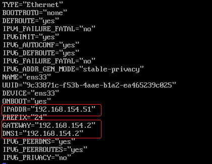
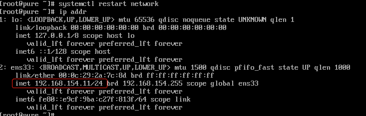

# 配置网络信息


在 CentOS 6 中， 网络设置及静态IP配置在 `/etc/sysconfig/network-scripts/ifcfg-eth0` 文件中配置，CentOS 7 网卡命令规则变化，命名规则根据系统固件和硬件来命名为 `ifcfg-en*` 类型。我的电脑网罗配置文件是：/etc/sysconfig/network-scripts/ifcfg-ens33。可用以下命令来查找自己的网络配置文件：

```
ll /etc/sysconfig/network-scripts/ | grep ifcfg-en
```

## 编辑网络配置文件

```shell
vim /etc/sysconfig/network-scripts/ifcfg-ens33
```





修改后重启，查看网卡信息是否正确生效。

```shell
#重启网卡
systemctl restart network
#查看ip信息是否正确生效
ip addr
```

