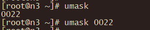

# 修改umask值

在Linux系统上，UMASK（用户掩码或用户文件创建掩码）指定了当一个新的文件或者新的文件夹被创建时被授予的默认权限，或基权限。大多数Linux发行版都将umask的默认值设为022。umask值为022表示授予了新创建的文件或者文件夹的读、写、以及执行权限为755。umask值为027则表示授予新创建的文件或文件夹的读、写、以及执行权限为750。

```shell
# 使用命令 umask 可以查看创建掩码
umask
# 修改 umask ，比如将 umask 修改为 0022
umask 0022
```

