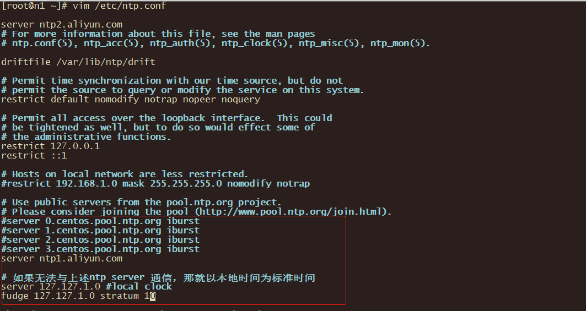
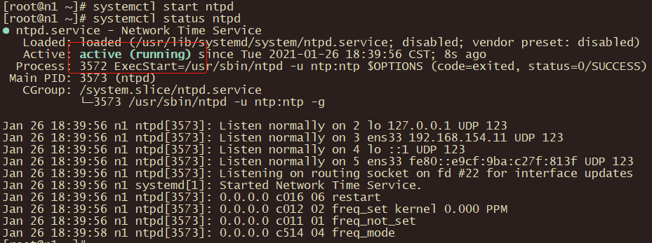
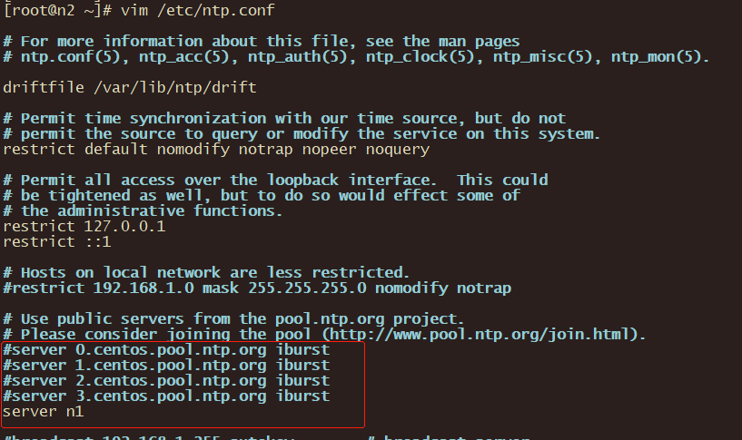
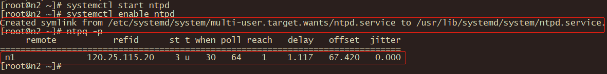

# 配置NTP时间同步

配置时间同步需要有一台节点作为server，其他节点作为client去同步server的时间。

| 主机名 |  角色  |
| :----: | :----: |
|   n1   | server |
|   n2   | client |
|   n3   | client |

## 前提

配置时间同步之前要确保节点之间可以ping通。即已经完成[配置hosts文件](../03-config-hosts/README.md)。

## 安装

三台都要安装NTP。

```shell
yum install -y ntp 
```

## 配置

### 先配置server

```shell
vim /etc/ntp.conf
```



启动ntp server，并查看状态。

```shell
# 启动
systemctl start ntpd
# 查看状态
systemctl status ntpd
```



验证是否成功启用同步。


设置开启自启。

```shell
systemctl enable ntpd
```

## 再配置client

修改配置文件，将server作为client要同步的时间服务器。所有的client都要配置。

```shell
vim /etc/ntp.conf
```



启动NTP服务，并将NTP服务加入开机自启。

```shell
systemctl start ntpd
systemctl enable ntpd
```

查看是否成功开启同步。

```shell
ntpq -p
```

