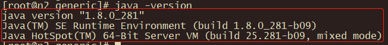

# 安装JDK

所有节点都要安装，建议安装jdk8以上版本。[下载地址](https://www.oracle.com/cn/java/technologies/javase/javase-jdk8-downloads.html)。

解压压缩包。

```shell
tar -zxvf jdk-8u281-linux-i586.tar.gz --no-same-owner
```

配置环境变量，保存后让其生效。

```sshell
# 配置
vim /etc/profile
# 生效
source /etc/profile
```

验证。

```shell
java -version
```

看到以下结果才算配置正确。

